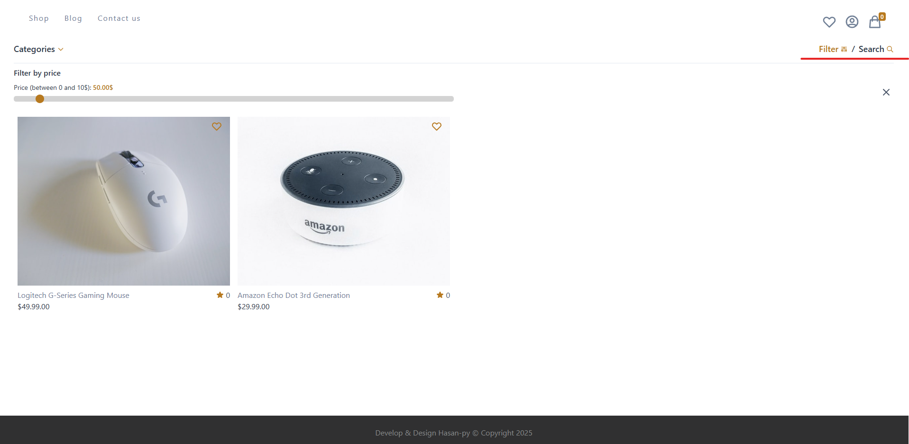
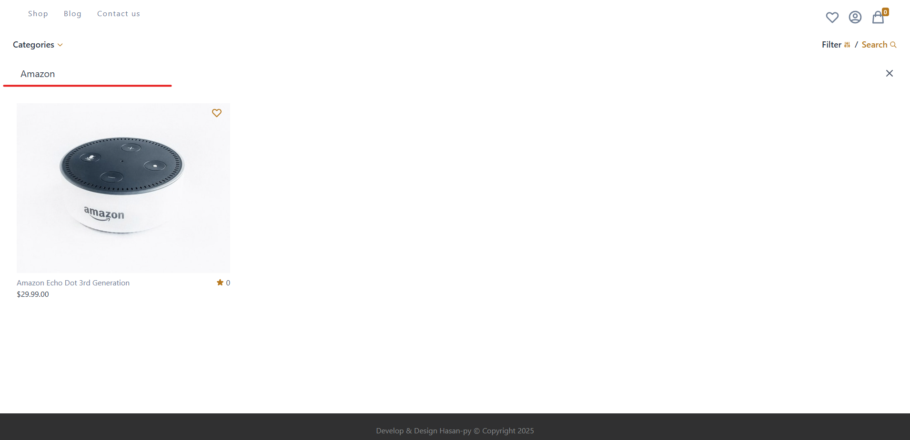
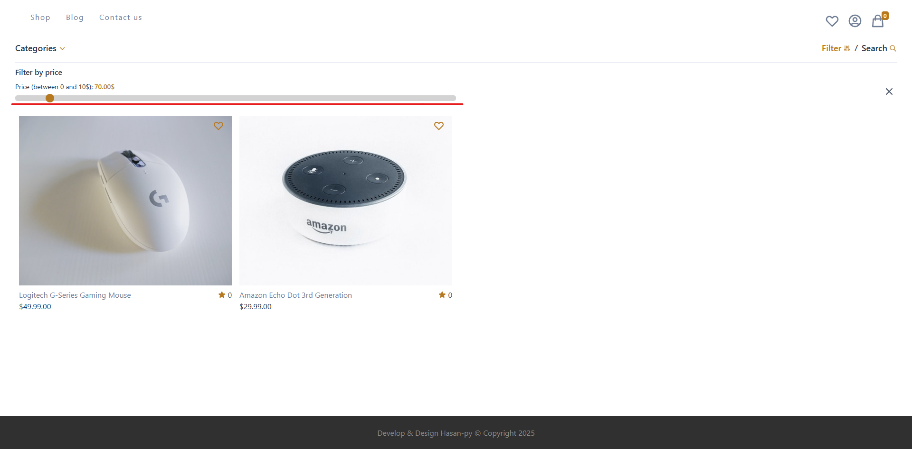

# Project Demo

This is a test project for full stack developers

## Getting Started

Design and implement a small, self‑contained enhancement to this app to demonstrate full‑stack skills, code quality, and UX judgment. Keep scope tight; prefer clear, well‑tested code over breadth.


## What you will build

### Update filter & search button

You can find those components in ./src/components/shop/home/ProductCategoryDropdown.js

### 1. Combine two buttons into one

#### Combine the filter and search functionalities into a single, unified button to streamline the user experience, allowing users to easily refine and search their queries simultaneously



### 2. Provide two search input fields - one for title, one for category

#### Enable users to perform a search using two keywords—one for the title and one for the description—allowing for more precise and relevant search results.


### 3. Enable search using minPrice and maxPrice

#### Provide two input fields instead of current slider, one for minPrice and another for maxPrice, allowing users to search for products within a specific price range.


## How To Install
```sh
$ npm install --legacy-peer-deps
$ npm start
```

## How To Migrate

```sh
$ npm run db:seed
```

### You can get the seed data from ./server/data/*.js